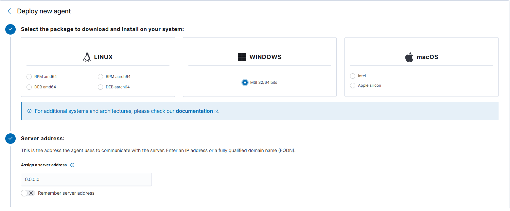

# Soc-homelab (DIY)

> [!WARNING]
> The following content is for educational purposes only and is not intended to teach how to hack enterprise infrastructure. Do good hack, not bad hack +🤠.

---

## 🧱 Architecture

```
Wazuh Security Lab
│
├── 01-file-integrity
├── 02-ssh-bruteforce
├── 03-user-creation
├── 04-privilege-escalation
├── 05-service-manipulation
├── 06-permission-change
└── 07-attack-timeline
```

### Lab topology (Kali → Windows → Wazuh)

```text
┌──────────────────┐
│    Kali Linux    │
│                  │
│   RDP Client     │
└────────┬─────────┘
         │
         │ RDP / TCP 3389
         ▼
┌──────────────────────────┐
│      Windows 11 Pro      │
│                          │
│    Wazuh Agent           │
│          │               │
│          ▼               │
│    C:\WazuhLab\          │
│          │               │
│       FIM Monitor        │
└──────────┬───────────────┘
           │
           │ Wazuh Agent
           ▼
┌──────────────────────────┐
│      Wazuh Manager       │
│                          │
│    File Integrity        │
│       Monitoring         │
└──────────┬───────────────┘
           │
           ▼
┌──────────────────────────┐
│      Wazuh Dashboard     │
└──────────────────────────┘
```

**Components**

- **Kali Linux** — used as the remote client in the simulation.
- **Windows 11 Pro** — the monitored endpoint.
- **Wazuh Agent** — installed on the Windows endpoint.
- **Wazuh Manager** — receives and analyzes telemetry from the endpoint.
- **Wazuh Dashboard** — used to investigate the generated events.

---

## Table of Contents

- [📎 Setting Up Wazuh SIEM (VM Box)](#-setting-up-wazuh-siem-vm-box)
- [🕵️‍♀️ Setting Up a Wazuh Agent](#️️-setting-up-a-wazuh-agent)
- [🗂️ 01 — File Integrity Monitoring (FIM)](#️-01--file-integrity-monitoring-fim)
  - [1. Create the Folder in Windows](#1-create-the-folder-in-windows)
  - [2. Locate ossec.conf](#2-locate-ossecconf)
  - [3. Locate the `<syscheck>` Configuration](#3-locate-the-syscheck-configuration)
  - [4. Add the Folder](#4-add-the-folder)
  - [5. Enable Real-Time Monitoring (Optional)](#5-enable-real-time-monitoring-optional)
  - [6. Save the File](#6-save-the-file)
  - [7. Restart the Agent](#7-restart-the-agent)
  - [8. Run a Test](#8-run-a-test)
  - [9. Check the Event in the Wazuh Dashboard](#9-check-the-event-in-the-wazuh-dashboard)
  - [10. Next Step: Enable Who-Data](#10-next-step-enable-who-data)
  - [Full Flow](#full-flow)
- [🖥️ Extended Lab: Simulating Remote Activity via RDP](#️-extended-lab-simulating-remote-activity-via-rdp)
  - [1. Preparing Windows 11 Pro](#1-preparing-windows-11-pro)
  - [2. Verify the RDP Service](#2-verify-the-rdp-service)
  - [3. Verify TCP Port 3389](#3-verify-tcp-port-3389)
  - [4. Configure Windows Firewall](#4-configure-windows-firewall)
  - [5. Find the Windows IP Address](#5-find-the-windows-ip-address)
  - [6. Test Connectivity from Kali](#6-test-connectivity-from-kali)
  - [7. Install an RDP Client on Kali](#7-install-an-rdp-client-on-kali)
  - [8. Establish the RDP Session](#8-establish-the-rdp-session)
  - [9. Creating the FIM Test Directory](#9-creating-the-fim-test-directory)
  - [10. Configuring Wazuh FIM](#10-configuring-wazuh-fim)
  - [11. Restart the Wazuh Agent](#11-restart-the-wazuh-agent)
  - [12. Test File Integrity Monitoring](#12-test-file-integrity-monitoring)
  - [13. Simulating Remote Activity](#13-simulating-remote-activity)
  - [14. What Wazuh Sees](#14-what-wazuh-sees)
  - [15. Testing File Creation](#15-testing-file-creation)
  - [16. Testing File Modification](#16-testing-file-modification)
  - [17. Testing File Deletion](#17-testing-file-deletion)
- [🧠 Thinking Like a SOC Analyst](#-thinking-like-a-soc-analyst)
- [🔁 From FIM to Incident Response](#-from-fim-to-incident-response)
- [✅ Why This Lab Is Useful](#-why-this-lab-is-useful)
- [📚 References](#-references)

---

## 📎 Setting Up Wazuh SIEM (VM Box)

1. [Click here to download](https://packages.wazuh.com/4.x/vm/wazuh-4.14.7.ova) the latest version of Wazuh VM from their official [website](https://documentation.wazuh.com/current/deployment-options/virtual-machine/virtual-machine.html).
2. Once the download is finished, find the `wazuh.ova` file and double-click it.
3. The machine comes with every configuration pre-installed — just hit **Finish** in VirtualBox.
4. Make sure the VM's network device is set to **Bridge mode**, and you're good to go.
5. When the server starts up, check that the services are running:

```bash
systemctl status wazuh-indexer
systemctl status wazuh-dashboard
systemctl status wazuh-manager
```

6. Open the dashboard in your browser: `https://<WAZUH-IP>`

---

## 🕵️‍♀️ Setting Up a Wazuh Agent (Windows 10/11)

1. When opening the dashboard for the first time, the first option is to add a new agent.
2. On the **Deploy new agent** tab, select your Operating System and **CHECK THE SERVER ADDRESS (Wazuh IP)**.



3. Copy/paste the two generated commands (1st installs the Wazuh agent packages, 2nd starts the Wazuh service).

> [!NOTE]
> When using a VM, UFW is not required, so you shouldn't run into "closed door" issues.

> [!TIP]
> Don't forget to reserve an IP address for your Wazuh server and agents on your router/modem's DHCP.

---

## 🗂️ 01 — File Integrity Monitoring (FIM)

A simple, step-by-step guide to add a specific folder on a Windows agent to Wazuh's File Integrity Monitoring (FIM) and verify that changes generate events.

This guide uses `C:\FIM-Test` as the example folder.

### 1. Create the Folder in Windows

Open PowerShell as Administrator:

```powershell
New-Item -ItemType Directory -Path "C:\FIM-Test"
```

Verify it was created:

```powershell
Get-Item "C:\FIM-Test"
```

You should see the folder's information printed out.

### 2. Locate ossec.conf

On the Windows agent, open:

```
C:\Program Files (x86)\ossec-agent\ossec.conf
```

If you installed the agent in a different directory, look for the `ossec.conf` file inside the installation folder.

Back up the file before making changes:

```powershell
Copy-Item `
  "C:\Program Files (x86)\ossec-agent\ossec.conf" `
  "C:\Program Files (x86)\ossec-agent\ossec.conf.bak"
```

### 3. Locate the `<syscheck>` Configuration

Inside `ossec.conf`, look for:

```xml
<syscheck>
```

You will likely already have a configuration similar to:

```xml
<syscheck>
    <disabled>no</disabled>
    ...
</syscheck>
```

> [!NOTE]
>  Don't create a separate `<syscheck>` block if one already exists. Add the new configuration inside the existing block.

### 4. Add the Folder

To get started, add:

```xml
<directories>C:\FIM-Test</directories>
```

For example:

```xml
<syscheck>
    <disabled>no</disabled>

    <frequency>300</frequency>

    <scan_on_start>yes</scan_on_start>

    <directories>C:\FIM-Test</directories>
</syscheck>
```

The `<directories>` parameter defines which directories Syscheck/FIM should monitor.

### 5. Enable Real-Time Monitoring (Optional)

For a lab environment, it's recommended to use `realtime="yes"`:

```xml
<directories realtime="yes">C:\FIM-Test</directories>
```

So the full block becomes:

```xml
<syscheck>
    <disabled>no</disabled>

    <frequency>300</frequency>

    <scan_on_start>yes</scan_on_start>

    <directories realtime="yes">C:\FIM-Test</directories>
</syscheck>
```

This way, you don't need to wait for the next scheduled scan to test changes. Wazuh supports real-time directory monitoring on Windows.

### 6. Save the File

Save `ossec.conf`. Before restarting the agent, double-check that you haven't introduced any XML syntax errors.

### 7. Restart the Agent

Open PowerShell as Administrator:

```powershell
Restart-Service -Name wazuh
```

Verify the service status:

```powershell
Get-Service wazuh
```

Expected output:

```
Status   Name
------   ----
Running  wazuh
```

### 8. Run a Test

Create a file inside the folder:

```powershell
New-Item -ItemType File -Path "C:\FIM-Test\teste.txt"
```

Write some content to it:

```powershell
Set-Content `
    -Path "C:\FIM-Test\teste.txt" `
    -Value "My first FIM test"
```

Modify it again:

```powershell
Set-Content `
    -Path "C:\FIM-Test\teste.txt" `
    -Value "Modified file"
```

And finally, delete it:

```powershell
Remove-Item "C:\FIM-Test\teste.txt"
```

With `realtime="yes"`, these changes should be detected by FIM almost immediately.

### 9. Check the Event in the Wazuh Dashboard

In the Dashboard, look for events related to the agent. You should find Syscheck/FIM events related to the file:

```
C:\FIM-Test\teste.txt
```

One particularly useful field is `syscheck.path`, which should show:

```
C:\FIM-Test\teste.txt
```

Also look for `syscheck.event`, which may show values such as:

- `added`
- `modified`
- `deleted`

### 10. Next Step: Enable Who-Data

Once the basic test is working, the recommended next step is:

```xml
<directories realtime="yes" whodata="yes">
    C:\FIM-Test
</directories>
```

This provides additional information about who made the change and which process was involved, making the experiment much more interesting from a security standpoint.

For example, instead of simply finding out:

```
C:\FIM-Test\teste.txt
        ↓
     modified
```

you can get information like:

```
File:    teste.txt
Event:   modified
User:    Administrator
Process: powershell.exe
```

### Full Flow

```
Windows Agent
     │
     │ file created/modified/deleted
     ▼
C:\FIM-Test
     │
     ▼
Syscheck / FIM
     │
     ▼
Wazuh Agent
     │
     ▼
Wazuh Manager
     │
     ▼
Wazuh Dashboard
     │
     ▼
File Integrity Event
```

> [!TIP]
> **Recommendation:** For your lab, start with just `C:\FIM-Test` + `realtime="yes"`. Once you've confirmed events are coming through, add `whodata`, and only then move on to real folders such as `C:\Windows\System32` or Registry keys. This avoids generating a huge volume of events before you understand the basic workflow.

---

## 🖥️ Extended Lab: Simulating Remote Activity via RDP

This section expands the basic FIM setup into a full scenario: a Kali Linux machine connects remotely to a Windows 11 Pro endpoint via RDP and triggers file events that Wazuh detects, giving the exercise a more realistic "attacker/analyst" flavor.

### 1. Preparing Windows 11 Pro

The first step is to configure the Windows endpoint to accept Remote Desktop connections.

Make sure the system is running **Windows 11 Pro**, since the traditional Remote Desktop server functionality is not available in Windows 11 Home.

Navigate to:

```text
Settings
└── System
    └── Remote Desktop
```

Enable:

```text
Remote Desktop: On
```

It's recommended to create a dedicated local account for the lab rather than using your primary Windows account:

```text
Username: lab-rdp
```

Using a dedicated account makes the experiment easier to isolate and document.

### 2. Verify the RDP Service

The Windows Remote Desktop service is called `TermService`.

From an elevated PowerShell session:

```powershell
Get-Service TermService
```

Expected result:

```text
Status   Name
------   ----
Running  TermService
```

If necessary:

```powershell
Start-Service TermService
Set-Service TermService -StartupType Automatic
```

### 3. Verify TCP Port 3389

Remote Desktop normally uses TCP port `3389`. To verify Windows is listening:

```powershell
Get-NetTCPConnection -LocalPort 3389
```

Another option:

```powershell
netstat -ano | findstr :3389
```

The important part is seeing a listener on port `3389`.

### 4. Configure Windows Firewall

Windows normally creates the appropriate firewall rules when Remote Desktop is enabled. They can be checked with:

```powershell
Get-NetFirewallRule -DisplayGroup "Remote Desktop"
```

If necessary, enable them with:

```powershell
Enable-NetFirewallRule -DisplayGroup "Remote Desktop"
```

For a homelab, it's important to keep the firewall enabled rather than disabling it entirely just to make the connection work.

### 5. Find the Windows IP Address

From PowerShell:

```powershell
ipconfig
```

For this example, the lab uses:

```text
Windows 11 Pro  →  192.168.56.20
Kali Linux      →  192.168.56.10
```

Both machines need network connectivity to each other.

### 6. Test Connectivity from Kali

From Kali Linux:

```bash
ping 192.168.56.20
```

ICMP may be blocked by Windows Firewall, so a failed ping does not necessarily mean RDP won't work. A better test for this scenario is checking TCP port 3389:

```bash
nc -zv 192.168.56.20 3389
```

A successful connection looks like:

```text
Connection to 192.168.56.20 3389 port [tcp/ms-wbt-server] succeeded!
```

### 7. Install an RDP Client on Kali

Install FreeRDP:

```bash
sudo apt update
sudo apt install freerdp3-x11
```

Verify the installation:

```bash
xfreerdp3 /version
```

### 8. Establish the RDP Session

Access the Windows machine from Kali:

```bash
xfreerdp3 /v:192.168.56.20 /u:lab-rdp
```

For a more convenient lab environment:

```bash
xfreerdp3 /v:192.168.56.20 /u:lab-rdp /dynamic-resolution
```

After authentication, the Windows desktop should appear inside the Kali environment. At this point, the remote access portion of the lab is complete.

### 9. Creating the FIM Test Directory

Now we need something for Wazuh to monitor. On Windows:

```powershell
New-Item -ItemType Directory -Path "C:\WazuhLab"
Set-Content -Path "C:\WazuhLab\test.txt" -Value "Original file"
```

The directory now looks like:

```text
C:\
└── WazuhLab\
    └── test.txt
```

This directory will be the controlled environment for the FIM experiments.

### 10. Configuring Wazuh FIM

The Wazuh Agent configuration file on Windows is typically located at:

```text
C:\Program Files (x86)\ossec-agent\ossec.conf
```

Depending on the installation, the path may instead be:

```text
C:\Program Files\ossec-agent\ossec.conf
```

Inside the `<syscheck>` configuration, add the directory:

```xml
<syscheck>
    <directories realtime="yes">C:\WazuhLab</directories>
</syscheck>
```

The `realtime="yes"` option is useful here because it allows Wazuh to monitor changes in real time.

### 11. Restart the Wazuh Agent

After modifying the configuration, restart the agent:

```powershell
Restart-Service WazuhSvc
Get-Service WazuhSvc
```

Expected:

```text
Status   Name
------   ----
Running  WazuhSvc
```

### 12. Test File Integrity Monitoring

Before using Kali, it's useful to verify that FIM is working locally.

```powershell
Add-Content -Path "C:\WazuhLab\test.txt" -Value "First modification"
```

In the Wazuh Dashboard, search for events related to `syscheck`. The event should provide information about the affected file and the detected modification.

### 13. Simulating Remote Activity

Now the actual lab scenario begins. Instead of modifying the file directly from the Windows console, connect to Windows remotely from Kali:

```bash
xfreerdp3 /v:192.168.56.20 /u:lab-rdp /dynamic-resolution
```

Once connected, open `C:\WazuhLab\test.txt`.

Initially:

```text
Original file
```

Modify it to:

```text
Original file

This line was added during the security lab simulation.
```

Save the file.

### 14. What Wazuh Sees

From the endpoint's perspective, the important event is not necessarily that the user connected via RDP — it's the file modification itself:

```text
File modification
        ↓
C:\WazuhLab\test.txt
        ↓
Wazuh FIM
        ↓
Wazuh Agent
        ↓
Wazuh Manager
        ↓
Dashboard
```

This is the core concept behind the lab: a file that was previously in one state has changed, and Wazuh can provide telemetry about that change.

### 15. Testing File Creation

Create another file through the RDP session:

```powershell
New-Item C:\WazuhLab\malware-test.txt
```

> The file does not contain real malware — it's simply a test artifact used to reproduce the type of event that could occur during an intrusion.

For example:

```text
SIMULATED MALICIOUS FILE
No executable code.
```

Wazuh should detect the new file:

```text
File Created → FIM Event → Wazuh
```

### 16. Testing File Modification

Modify the same file:

```powershell
Add-Content C:\WazuhLab\malware-test.txt "Simulated modification"
```

This generates another FIM event:

```text
File Modified → Wazuh FIM
```

### 17. Testing File Deletion

Finally:

```powershell
Remove-Item C:\WazuhLab\malware-test.txt
```

This allows the lab to demonstrate three different file integrity events:

```text
CREATE → MODIFY → DELETE
```

These events provide a simple but useful foundation for learning how endpoint telemetry can be used during an investigation.

---

## 🧠 Thinking Like a SOC Analyst

The interesting part of this lab isn't simply seeing that a file changed — it's asking:

> **Why did this file change?**

Example event context:

```text
Event: File modified
Host:  Windows 11 Pro
File:  C:\WazuhLab\test.txt
Time:  2026-08-29 12:XX:XX
```

A SOC analyst would then want additional context, such as:

- Who was logged into the machine?
- Was there an RDP session?
- Was the modification expected?
- What process modified the file?
- Was the file newly created?
- Did other files change?
- Did the same user perform other suspicious actions?
- Were there authentication anomalies?
- Did other security controls generate alerts?

This is where FIM becomes more useful when combined with other telemetry sources.

---

## 🔁 From FIM to Incident Response

The lab can eventually be expanded into a basic incident-response workflow:

```text
                 ┌───────────────┐
                 │ Remote Access │
                 └───────┬───────┘
                         ↓
                 ┌───────────────┐
                 │ File Created  │
                 └───────┬───────┘
                         ↓
                 ┌───────────────┐
                 │ FIM Detection │
                 └───────┬───────┘
                         ↓
                 ┌───────────────┐
                 │ Investigation │
                 └───────┬───────┘
                         ↓
                 ┌───────────────┐
                 │    Response   │
                 └───────────────┘
```

The next step would be integrating **Wazuh Active Response**. For example, a controlled lab could detect the creation of a specific test file and trigger a predefined response.

> [!WARNING]
> This should be implemented carefully — automatically deleting or modifying files based only on a FIM event can generate false positives in a real environment.

---

## ✅ Why This Lab Is Useful

This project demonstrates several concepts that are relevant to a SOC environment:

| Concept | Description |
|---|---|
| **Endpoint Monitoring** | The Windows machine acts as a monitored endpoint. |
| **File Integrity Monitoring** | Wazuh detects changes to files and directories. |
| **Remote Access** | Kali simulates a remote system connecting to the Windows endpoint through RDP. |
| **Security Telemetry** | Modifications generate telemetry that can be investigated. |
| **Detection Engineering** | The next stage is creating rules that distinguish ordinary file changes from suspicious activity. |
| **Incident Response** | Active Response can eventually be introduced to demonstrate automated containment or remediation. |

---

## 📚 References
(PT-BR) -> https://www.youtube.com/watch?v=ZvfSGRnfYfo&t=334s<br>(EN) -> https://www.youtube.com/watch?v=3CaG2GI1kn0&t=151s

> [!NOTE]
> For more information, visit [my website](https://cout-magicgnom.github.io/website/projects/documents.html) for the full vulnerabilities walkthrough
